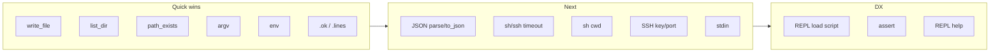

# B2 product feature plan

Jan and Niek are boring as hell.

---

## Intro

B2 today gives you: a small language (functions, lambdas, arrays/dicts, control flow, types/records), **sh** / **ssh** returning `{ stdout, stderr, exit_code, duration_ms }`, **parallel for**, builtins (log, read_file, map/filter/sort/etc.), **net** (ping, http, tcp), string/number methods, a TUI REPL, and script imports. There is **read_file** but no **write_file**; no script arguments or env access; no JSON; no timeout or cwd for shell; REPL has no way to load a script file.

---

## 1. High value, low effort

**File I/O**

- **write_file(path, contents)** — Scripts often need to write results or configs. Today only [core.rs](../src/runtime/builtins/core.rs) has `read_file`. Add a native that does `fs::write`. Optional: append mode.
- **list_dir(path)** — Return array of filenames (or names + metadata) for "run command per file" or "find files matching" workflows.
- **path_exists(path)** / **is_file** / **is_dir** — Avoid calling `sh "test -f ..."` for simple checks.

**Script arguments and env**

- **argv** — Global or builtin that exposes script arguments (e.g. `cargo run -- script.s --foo bar` → script can read args). Requires [args.rs](../src/cli/args.rs) and [io.rs](../src/cli/io.rs) to pass args through to the executor and expose them (e.g. as a global array or `args()` builtin).
- **env** — Read env vars from script (e.g. `env("HOME")`) so scripts can adapt to environment without `sh "echo $HOME"`.

**Shell result ergonomics**

- **.ok** on the dict returned by `sh`/`ssh` — e.g. `r.ok` true when `exit_code == 0`. Convenience for conditionals.
- **.lines** — Return array of lines from `stdout` (or a method on string that's already there, used on `r.stdout`). Very common after running a command.

These fit the "script with shell results" story and are straightforward to add in the runtime and builtins.

---

## 2. High value, mid effort

**JSON**

- **parse_json(string)** and **to_json(value)** — Many scripts consume API output or config files. Today you'd have to call an external tool. Adding a dependency (e.g. `serde_json`) and two builtins gives a big upgrade for "script + HTTP + data" use cases.

**Shell/SSH upgrades**

- **Timeout** for `sh` and `ssh` — Optional timeout argument so long-running or stuck commands don't hang the script. [sh.rs](../src/runtime/shell/sh.rs) and [ssh.rs](../src/runtime/shell/ssh.rs) would need to run the command with a timeout (e.g. Rust timeout or background thread + kill).
- **Working directory** for `sh` — Optional `cwd` so scripts can run commands in a given directory without building cd into the command string.
- **SSH options** — Key path, port, user (or parse `user@host`). Makes SSH usable in more real-world setups.

**Stdio**

- **stdin()** — Read stdin (e.g. whole input or line-by-line) so B2 scripts can be used in pipes: `cat list.txt | b2 script.s`.
- **stderr** builtin or channel — Explicit "log to stderr" for tooling (vs log to stdout).

**REPL**

- **Load script** — Command or builtin to evaluate a `.s` file inside the REPL (e.g. `:load script.s`) so you can experiment on top of a script's definitions.

---

## 3. Medium value, variable effort

**Concurrency control**

- **Rate limit / semaphore for parallel for** — Cap concurrency (e.g. "at most 5 SSH at a time") to avoid thundering herd and respect remote limits. Could be a modifier on `parallel for` or a wrapper builtin.

**Assertions and testing**

- **assert(condition, message?)** — Fail script with a clear message. Useful for scripts that validate state.
- **Test runner** — Optional `cargo test`-driven runner for `.s` files (run script, assert on exit code or stdout). Builds on existing e2e-style tests.

**Packaging and distribution**

- **Shebang** — Support `#!/usr/bin/env b2` so scripts can be executed directly (e.g. `./script.s`) once `b2` is on PATH.
- **Install** — Document or streamline `cargo install --path .` so users get a single `b2` (or `v2r`) binary.

**Docs and discovery**

- **REPL help** — `:help` or `?log` showing builtin/module docs. Requires storing doc strings and exposing them in the REPL.
- **Standard library doc** — One place (e.g. README or `docs/stdlib.md`) listing builtins and `net` with signatures and short examples.

---

## 4. Large/niche additions

- **Regex builtin** — Match/split/replace by regex without calling out to `grep`/`sed`. Depends on whether you want to keep "shell-oriented" or add more string power in-process.
- **Config file** — Optional config (e.g. default SSH key, timeout, parallelism) so scripts don't hardcode.
- **Debug / trace** — `trace(expr)` or `breakpoint()` that prints value and span; or a debugger hook for stepping (much larger).
- **More net** — HTTPS client options (headers, POST body, auth), or a small WebSocket helper if needed for scripting UIs or services.

---

## Prio

1. **Quick wins** — `write_file`, `path_exists`, `argv`, `env`, and `.ok` / `.lines` on shell results. These directly support "script that runs commands and writes results or branches on args/env."
2. **JSON** — `parse_json` / `to_json` plus `net.http` make "call API and process JSON" a first-class workflow.
3. **Shell/SSH** — Timeout and optional cwd for `sh`; SSH key/port/user. Then stdin/stderr for pipes and tooling.
4. **REPL and DX** — Load script in REPL, assert builtin, then REPL help and stdlib doc.
5. **Scale and polish** — Concurrency cap for parallel for, shebang, test runner, then config and niche features as needed.

---

## Summary diagram

